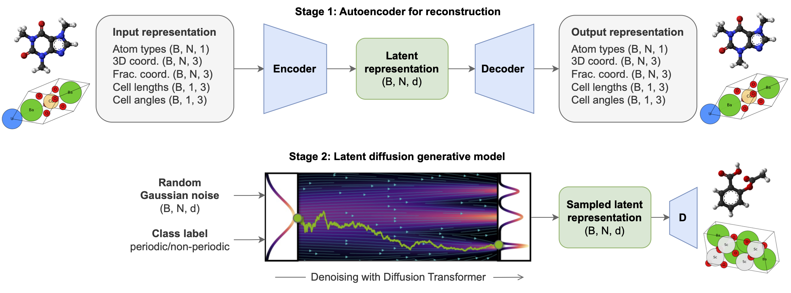

# All-atom Diffusion Transformers

Code for the paper [*"All-atom Diffusion Transformers: Unified generative modelling of molecules and materials"*](https://www.arxiv.org/abs/2503.03965), by [Chaitanya K. Joshi](https://www.chaitjo.com/), [Xiang Fu](https://xiangfu.co/), [Yi-Lun Liao](https://www.linkedin.com/in/yilunliao), [Vahe Gharakhanyan](https://gvahe.github.io/), [Benjamin Kurt Miller](https://www.mathben.com/), [Anuroop Sriram*](https://anuroopsriram.com/), and [Zachary W. Ulissi*](https://zulissi.github.io/) from FAIR Chemistry at Meta (* Joint last author).

All-atom Diffusion Transformers (ADiTs) jointly generate both periodic materials and non-periodic molecular systems using a unified latent diffusion framework:
- An autoencoder maps a unified, all-atom representations of molecules and materials to a shared latent embedding space; and
- A diffusion model is trained to generate new latent embeddings that the autoencoder can decode to sample new molecules or materials.



## Installation

List of dependencies used is available as `requirements.txt`, exported with `pipreqs`.
It may be possible that some ad-hoc dependencies are missing, in which case you can simply `pip install` them.

```bash
# clone project
git clone https://github.com/facebookresearch/all-atom-diffusion-transformer
cd all-atom-diffusion-transformer

# create new python environment
mamba create -n myenv python=3.10 -c defaults
mamba activate myenv

# install pytorch according to instructions (use CUDA version for your system)
# https://pytorch.org/get-started/
mamba install pytorch==2.3.1 torchvision==0.18.1 torchaudio==2.3.1 pytorch-cuda=12.1 -c pytorch -c nvidia -c defaults

# install pytorch geometric (use CUDA version for your system)
# https://pytorch-geometric.readthedocs.io/
pip install torch_geometric
pip install torch_scatter torch_cluster -f https://data.pyg.org/whl/torch-2.3.0+cu121.html

# install other libraries (see requirements.txt for versions)
pip install lightning==2.4.0 hydra-core==1.* hydra-colorlog
mamba install ase==3.23.0  # individually installed due to dependency conflict
mamba install matminer==0.9.2  # individually installed due to dependency conflict
mamba install smact==2.6 openbabel==3.1.1 jupyterlab pandas seaborn joblib yaml -c conda-forge
pip install pyxtal==0.6.7 mofchecker==0.9.6 rdkit==2024.3.5 e3nn==0.5.1 posebusters==0.3.1 download==0.3.5 ipdb wandb rootutils rich pathos p-tqdm einops svgwrite cairosvg reportlab lmdb torchdiffeq huggingface_hub

# install pre-commit hooks (optional)
pip install pre-commit
pre-commit install
```

## Usage

Our codebase is built upon the [lightning-hydra template](https://github.com/ashleve/lightning-hydra-template/), who's README provides a general overview of usage.

**Datasets:**

All datasets will be downloaded and processed automatically when running the code for the first time via PyG/HuggingFace:
- Small molecules: [QM9 on PyG](https://pytorch-geometric.readthedocs.io/en/latest/generated/torch_geometric.datasets.QM9.html)
- Inorganic crystals: [MP20 on HuggingFace](https://huggingface.co/datasets/chaitjo/MP20_ADiT) (includes processed files)
- Metal-organic frameworks: [QMOF150 on HuggingFace](https://huggingface.co/datasets/chaitjo/QMOF150_ADiT) (includes processed files)

Downloading and processing all three datasets can take around 1/2 hour, but only needs to happen one time.

**Training and evaluating models:**

Running training scripts for VAEs and DiTs will train the model as well as compute evaluation metrics during validation.
Everything is logged to W&B and CIF/PDB files can also be optionally saved for visualization over the course of training.
All our experiments were performed on V100 GPUs. We generally trained all models on 4 or 8 GPUs, and train till convergence or if we hit a time limit of 3 days per job on a SLURM cluster.

**Step 0:** Set paths to data and logging directories in `configs/paths/default.yaml` and wandb entity/project in `configs/logging/wandb.yaml`.

**Step 1:** Train a VAE model; example script: `slurm/train_ddp_vae.sh`. Key hyperparameters to be specified in `configs/autoencoder_module/vae.yaml` include:

- Choice of encoder and decoder (pure Transformer, Equiformer)
- Latent dimension (generally something small like 4/8 works well)
- KL regularization loss weight (we use 0.0001/0.00001, higher weight leads to slower convergence)
- Denoising objective corruption percentage (use 10%/25%)

**Step 2:** Train a DiT model with (frozen) VAE as a component; example script: `slurm/train_ddp_diffusion.sh`. Key hyperparameters to be specified in `configs/diffusion_module/ldm.yaml` include:

- DiT model scale (DiT-S: 30M, DiT-B: 150M, DiT-L: 450M; DiT-S works well enough)
- Frozen VAE checkpoint path and latent dimension.

**Step 4:** Evaluate trained DiT model for molecule and crystal generation by setting the checkpoint path in `configs/eval_diffusion.yaml` and running `src/eval_diffusion.py`.
Note that evaluation is best done via wandb sweep (template: `configs/sweep/eval_sweep_template.yaml`) and example script: `slurm/sweep_gpu.sh`. The sweep template requires setting the path to the checkpoint of the DiT to be evaluated (as well as the corresponding VAE) and needs to be started on wandb. Once created, you will get the command to run the sweep based on its wandb id. You can then launch the sweep on your cluster via `slurm/sweep_gpu.sh`.

## Project Structure

```
├── configs                             <- Hydra configs
│   ├── autoencoder_module                <- VAE LitModule configs
│   ├── callbacks                         <- Callbacks configs
│   ├── data                              <- Data configs
│   ├── encoder                           <- VAE encoder configs
│   ├── decoder                           <- VAE decoder configs
│   ├── diffusion_module                  <- Latent diffusion/DiT LitModule configs
│   ├── extras                            <- Extra utilities configs
│   ├── hydra                             <- Hydra configs
│   ├── logger                            <- Logger configs (for W&B)
│   ├── paths                             <- Project paths configs
│   ├── trainer                           <- Trainer configs
│   │
│   ├── train_autoencoder.yaml          <- Main config for training VAEs
│   ├── train_diffusion.yaml            <- Main config for training DiTs
│   ├── eval_autoencoder.yaml           <- Main config for evaluating trained VAEs
│   └── eval_diffusion.yaml             <- Main config for sampling from/evaluating trained DiTs
|
├── src                       <- Source code (same directory structure as configs)
|
├── slurm                     <- Example slurm scripts for launching training runs and experiments
│
├── data                      <- Datasets directory
│
├── .gitignore                <- List of files ignored by git
├── .pre-commit-config.yaml   <- Configuration of pre-commit hooks for code formatting
├── .project-root             <- File for inferring the position of project root directory
├── CODE_OF_CONDUCT.md        <- Code of conduct to define community standards
├── CONTRIBUTING              <- Guidelines for repository contributions
├── LICENCE                   <- CC-BY-NC license file
├── pyproject.toml            <- Configuration options for testing and linting
├── requirements.txt          <- File for installing python dependencies
|
└── README.md
```

## Citation

ArXiv link: [*"All-atom Diffusion Transformers: Unified generative modelling of molecules and materials"*](https://www.arxiv.org/abs/2503.03965)

```
@article{joshi2025allatom,
  title={All-atom Diffusion Transformers: Unified generative modelling of molecules and materials},
  author={Chaitanya K. Joshi and Xiang Fu and Yi-Lun Liao and Vahe Gharakhanyan and Benjamin Kurt Miller and Anuroop Sriram and Zachary W. Ulissi},
  journal={arXiv preprint},
  year={2025},
}
```

## Licence

The majority of the All-atom Diffusion Transformers code is licenced under CC-BY-NC.
Portions of the code are adapted from [ase-notebook](https://github.com/chrisjsewell/ase-notebook/) (MIT licence) and [equiformer-v2](https://github.com/atomicarchitects/equiformer_v2/) (MIT license).
